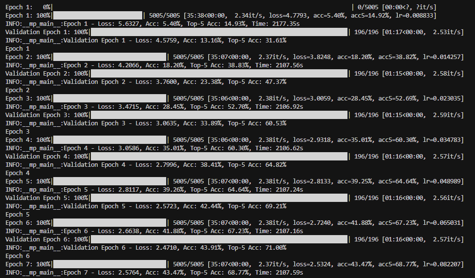
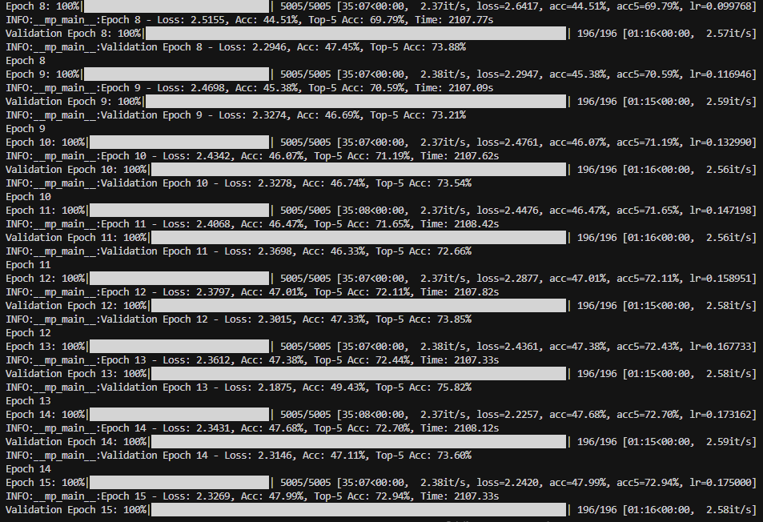
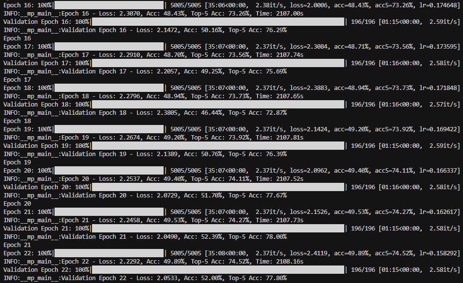
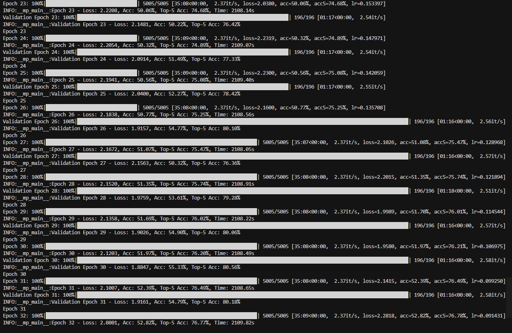
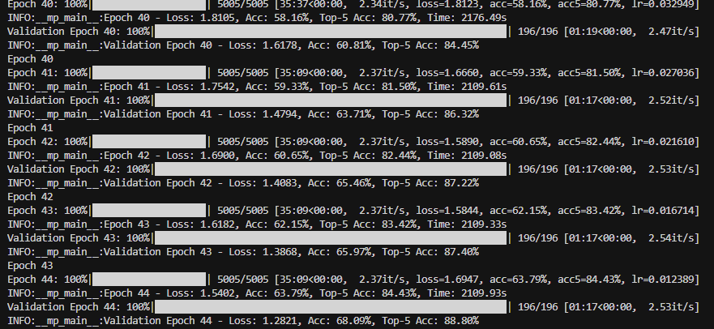
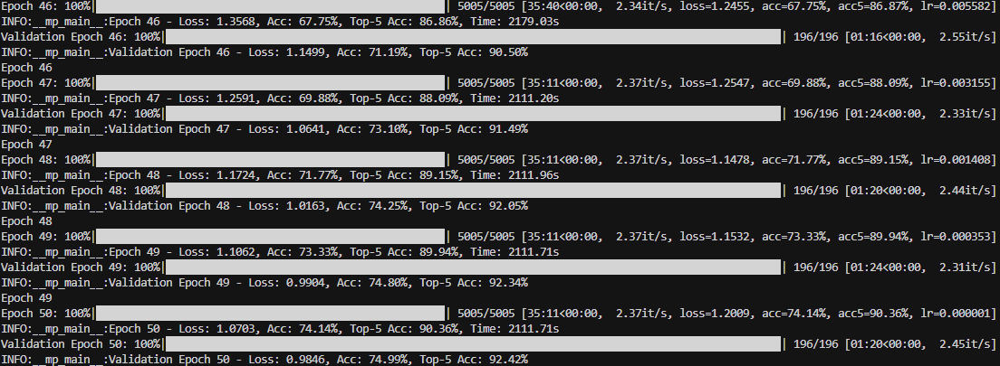
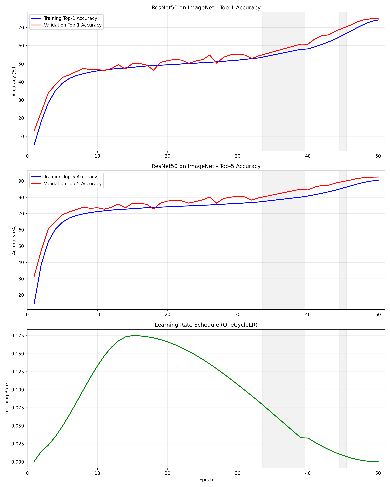
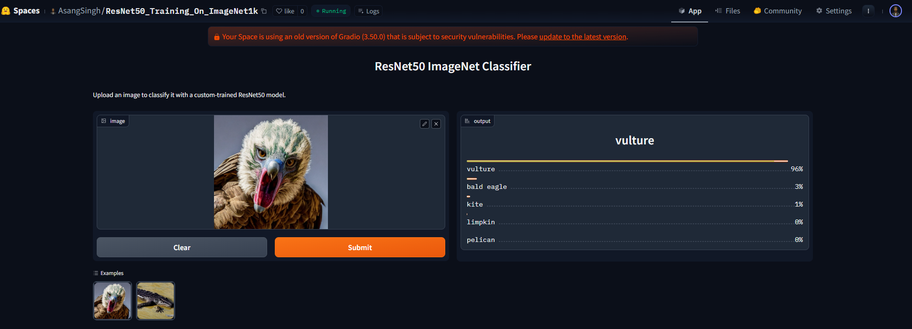

# ResNet50 Training on ImageNet-1K

This repository contains the code and documentation for training a ResNet50 deep learning model on the ImageNet-1K dataset using distributed training on AWS EC2.

## About ResNet50

ResNet50 is a 50-layer deep convolutional neural network architecture that introduced the concept of residual learning. Developed by Microsoft Research in 2015, it addresses the vanishing gradient problem in deep networks by using skip connections (residual blocks) that allow gradients to flow through the network more effectively. This architecture enables the training of much deeper networks than was previously possible.

Key features of ResNet50:
- 50 layers deep with 23 million trainable parameters
- Uses residual connections to improve gradient flow
- Consists of 5 stages with convolution and identity blocks
- Widely used as a backbone for many computer vision tasks

## About ImageNet-1K

ImageNet-1K (ILSVRC2012) is a large-scale visual recognition dataset containing:
- 1.2 million training images
- 50,000 validation images
- 1,000 object categories
- Images collected from the web and labeled by human annotators

It has become the standard benchmark for evaluating image classification models and is widely used in computer vision research and applications.

## Project Structure

- `model.py` - Defines the ResNet50 model architecture
- `train.py` - Main training script with distributed training support
- `dataset_paths.py` - Configuration for dataset paths
- `lr_finder.py` - Utility for finding optimal learning rates
- `setup_and_train.sh` - Shell script to set up the environment and start training
- `ImageNet_Setup_Guide.md` - Guide for downloading and setting up the ImageNet dataset
- `requirements.txt` - Python dependencies for the project

## AWS EC2 Configuration

Due to quota limitations, we used the following EC2 configuration:

- **Instance Type**: g5.2xlarge
- **vCPUs**: 8
- **GPUs**: 1 x NVIDIA A10G
- **Memory**: 32 GB
- **Region**: ap-south-1b


## Storage Configuration

A 500GB EBS volume was created and attached to the EC2 instance to store the ImageNet-1K dataset. This size was chosen to accommodate:
- Raw dataset files (~150GB)
- Extracted training and validation images (~300GB)
- Model checkpoints and logs

## Dataset Setup

The ImageNet-1K dataset was downloaded and set up following the instructions in [ImageNet_Setup_Guide.md](images/ImageNet_Setup_Guide.md). This guide includes:
- Creating and mounting an EBS volume
- Downloading the dataset using academic torrents
- Extracting and organizing the data into the proper directory structure
- Preparing the validation set with the correct folder structure

## Training Process

### Initial Setup and Training

1. Connect to your EC2 instance using SSH:
   
   To find the exact SSH command:
   - Go to your EC2 instance in the AWS Management Console
   - Click on "Connect" button at the top
   - Select the "SSH client" tab
   - Copy the SSH command provided at the bottom of the panel
   
   The command will look like:
   ```bash
   ssh -i "your-key.pem" ubuntu@ec2-xx-xx-xx-xx.compute-1.amazonaws.com
   ```
   
   Paste this command in your local terminal to connect to the EC2 instance.

2. Verify that your 500GB EBS volume is present:
   ```bash
   lsblk
   ```
   Make sure the volume name in `setup_and_train.sh` matches your actual volume (default is `/dev/nvme2n1`).

3. Open a new bash/terminal and transfer the setup script to your EC2 instance:
   ```bash
   scp -i your-key.pem setup_and_train.sh ubuntu@your-ec2-instance-ip:~/
   ```

4. Make the script executable and run it:
   ```bash
   chmod +x ~/setup_and_train.sh
   ~/setup_and_train.sh
   ```
   This script will:
   - Mount the EBS volume
   - Set up the Python environment
   - Clone the repository
   - Install dependencies
   - Start the training process

### Resuming Interrupted Training

If your SSH session is interrupted or lost, you can resume training without repeating the setup:

1. Connect to your EC2 instance using the SSH command from AWS Console:
   
   To find the exact SSH command:
   - Go to your EC2 instance in the AWS Management Console
   - Click on "Connect" button at the top
   - Select the "SSH client" tab
   - Copy the SSH command provided at the bottom of the panel
   
   ```bash
   ssh -i "your-key.pem" ubuntu@ec2-xx-xx-xx-xx.compute-1.amazonaws.com
   ```

2. Navigate to the training directory:
   ```bash
   cd /mnt/imagenet/ResNet50_ImageNet1K_Training
   ```
   
   If you get a "No such file or directory" error:
   
   a. First check if the EBS volume is mounted:
   ```bash
   df -h | grep /mnt/imagenet
   ```
   
   b. If not mounted, mount it (replace /dev/nvme2n1 with your actual device from `lsblk`):
   ```bash
   sudo mkdir -p /mnt/imagenet
   sudo mount /dev/nvme2n1 /mnt/imagenet
   ```
   
   c. Find where your code is located:
   ```bash
   find /mnt -name "train.py" 2>/dev/null
   ```
   
   d. Navigate to the directory containing train.py:
   ```bash
   cd /path/to/directory/found/above
   ```

3. Resume training:
   ```bash
   python train.py
   ```
   
The training will automatically resume from the last saved checkpoint.

## Setup Script Explanation

The `setup_and_train.sh` script automates the entire setup and training process. Here's what it does:

1. **EBS Volume Setup**
   - Checks if the EBS volume exists at the expected path
   - Creates a mount point at `/mnt/imagenet`
   - Mounts the EBS volume if not already mounted

2. **Python Environment Setup**
   - Installs Python 3.12 if not present
   - Creates a virtual environment at `/mnt/imagenet/resnet50`
   - Activates the virtual environment
   - Upgrades pip to the latest version

3. **Repository Setup**
   - Navigates to the `/mnt/imagenet` directory
   - Creates a `ResNet50_ImageNet1K_Training` directory
   - Clones the repository or updates it if already exists
   - Handles local changes with options to:
     - Reset changes and pull latest
     - Backup changes and pull latest
     - Merge local changes with latest
     - Keep local changes only
   - Installs Python requirements from `requirements.txt`

4. **Training Execution**
   - Starts the training process by running `train.py`
   - Training automatically uses all available GPUs
   - Checkpoints are saved after each epoch for resuming if interrupted

## Training Results

The model was trained for 50 epochs using distributed training across 8 GPUs with the following hyperparameters:
- Batch size: 256
- Learning rate: 0.175 (with OneCycleLR scheduler)
- Momentum: 0.9
- Weight decay: 1e-4
- Training time: ~32 minutes per epoch

### Learning Rate Selection

The optimal learning rate of 0.175 was determined using the `lr_finder.py` script, which implements the Learning Rate Finder technique. This approach:

1. Trains the model for a few iterations while exponentially increasing the learning rate
2. Plots the loss against the learning rate to identify the optimal range
3. Selects the learning rate where the loss decreases most rapidly

We ran the LR Finder multiple times with different parameter ranges to get a comprehensive view:
```bash
python lr_finder.py --start_lr=1e-7 --end_lr=10 --num_iter=100
```

This generated three different plots showing the loss curve at different learning rate scales:

<div>

<table>
  <tr>
    <td><b>Full Range Plot</b>: Shows the entire learning rate range from 10^-6 to 10^1</td>
  </tr>
  <tr>
    <td align="center"></td>
  </tr>
  <tr>
    <td><b>High Range Plot</b>: Focuses on learning rates from 0.1 to 10</td>
  </tr>
  <tr>
    <td align="center"></td>
  </tr>
  <tr>
    <td><b>Mid Range Plot</b>: Focuses on learning rates from 0.01 to 1</td>
  </tr>
  <tr>
    <td align="center"></td>
  </tr>
</table>

</div>

By analyzing these plots, we observed:
- At very low learning rates (< 10^-2), the loss remains relatively flat
- The steepest descent occurs around 0.1-0.2
- Beyond learning rate 1.0, the loss begins to increase again

Based on these observations, we selected 0.175 as our base learning rate for the OneCycleLR scheduler, as it falls within the range of steepest descent while avoiding potential instability at higher rates.

> **Note:** We limited training to 50 epochs due to the inferior instance type (constrained by our quota allocation of 8 vCPUs), frequent EC2 interruptions, and cost considerations. With better infrastructure, training could be extended to 90-100 epochs for potentially higher accuracy.

### Training Progress

Below are screenshots showing the training progress with TQDM progress bars in the terminal:










### Training Metrics



| Epoch | Time (min) | Train Loss | Train Acc (%) | Train Top-5 (%) | Val Loss | Val Acc (%) | Val Top-5 (%) |
|-------|-----------|------------|---------------|---------------|----------|-------------|--------------|
| 1     | 32        | 5.6327     | 5.40          | 14.92         | 4.5759   | 13.16       | 31.61        |
| 10    | 32        | 2.4761     | 46.07         | 71.19         | 2.3278   | 46.74       | 73.54        |
| 20    | 32        | 2.0962     | 49.40         | 74.11         | 2.0729   | 51.70       | 77.67        |
| 30    | 32        | 1.9580     | 51.97         | 76.21         | 1.8847   | 55.33       | 80.56        |
| 40    | 32        | 1.8123     | 58.16         | 80.77         | 1.6178   | 60.81       | 84.45        |
| 50    | 32        | 1.2009     | 74.14         | 90.36         | 0.9846   | 74.99       | 92.42        |

### Final Model Performance

<div align="center">
<h2>ResNet50 on ImageNet-1K after 50 epochs</h2>
<table>
  <tr>
    <td align="center"><h3>Top-1 Accuracy</h3></td>
    <td align="center"><h3>Top-5 Accuracy</h3></td>
  </tr>
  <tr>
    <td align="center"><h2>74.99%</h2></td>
    <td align="center"><h2>92.42%</h2></td>
  </tr>
</table>
</div>

## Cost Analysis

- **EC2 Instance (g5.2xlarge)**: ~$1.21/hour
- **EBS Storage (500GB)**: ~$50/month
- **Total Training Cost** (50 epochs × 32 minutes = ~26.7 hours): ~$32.31

## Future Work

- Implement mixed precision training for faster training
- Experiment with different optimizers and learning rate schedules
- Add support for model pruning and quantization
- Implement TensorRT optimization for inference

## HuggingFace Space Demo

You can try out the trained model using our HuggingFace Space. Upload an image and get real-time predictions from our ResNet50 model trained on ImageNet-1K.

[](https://huggingface.co/spaces/AsangSingh/ResNet50_Training_On_ImageNet1k)

Visit the demo: [ResNet50 ImageNet1K Classifier](https://huggingface.co/spaces/AsangSingh/ResNet50_Training_On_ImageNet1k)

## License

This project is licensed under the MIT License - see the [LICENSE](LICENSE) file for details.
